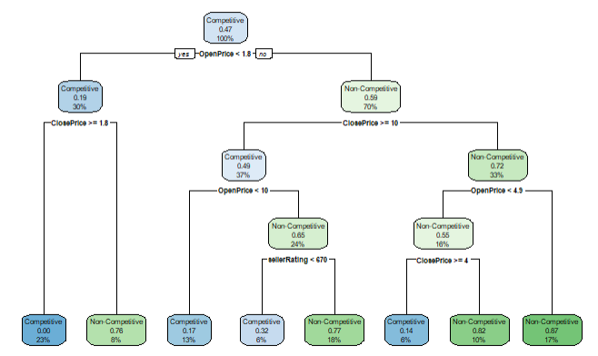
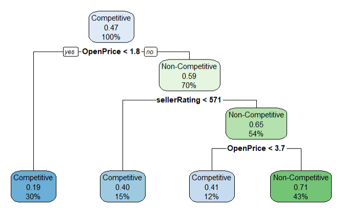

# eBayAuctions

eBayAuctions uses classification to predict whether an eBay auction will be competitive or non-competitive. This uses the machine learning technique of Decision Trees.

The decision tree with all the predictors is as follows:

The decision tree with only the significant predictors is as follows:

